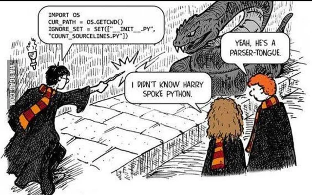

<!-- PROJECT SHIELDS -->
<!--
*** I'm using markdown "reference style" links for readability.
*** Reference links are enclosed in brackets [ ] instead of parentheses ( ).
*** See the bottom of this document for the declaration of the reference variables
*** for contributors-url, forks-url, etc. This is an optional, concise syntax you may use.
*** https://www.markdownguide.org/basic-syntax/#reference-style-links
-->
[![LinkedIn][linkedin-shield]][linkedin-url]

<!-- PROJECT LOGO -->
 

  

<h1 align="center">Caleb's Python Repo</h1>

  

    This repo holds my 100 days of python content, but also stores solutions from algo challenges solved in Python, and any miscellaneous scripts I've written that don't belong anywhere else. So far, the coolest thing in here is probably the hangman game.
     
  

<!-- ABOUT THE PROJECT -->
## About The Project

[100 Days of Python](https://github.com/calebthewood/Python-100-Days/tree/main/100_days)

[HackerRank](https://github.com/calebthewood/Python-100-Days/blob/main/hacker-rank.py)

(<a href="#top">back to top</a>)

### Built With

* [Python3](https://docs.python.org/3/)
* [iPython](https://ipython.org/)

(<a href="#top">back to top</a>)

<!-- ROADMAP -->
## Roadmap

- [x] Add HackerRank solutions
- [ ] Add LeetCode Solutions
- [ ] Personal Scripts
- [ ] Interview Questions

(<a href="#top">back to top</a>)

<!-- CONTACT -->
## Contact

Caleb Wood - [@calebthewood](https://twitter.com/calebthewood)

Project Link: [https://github.com/calebthewood/Python-100-Days](https://github.com/calebthewood/Python-100-Days)

(<a href="#top">back to top</a>)

<!-- ACKNOWLEDGMENTS -->
## Acknowledgments

* [The App Brewery](https://appbrewery.com/)
* [Rithm School](https://www.rithmschool.com/)
* [HackerRank](https://www.hackerrank.com/dashboard)

(<a href="#top">back to top</a>)

<!-- MARKDOWN LINKS & IMAGES -->
<!-- https://www.markdownguide.org/basic-syntax/#reference-style-links -->
[linkedin-shield]: https://img.shields.io/badge/-LinkedIn-black.svg?style=for-the-badge&logo=linkedin&colorB=555
[linkedin-url]: https://www.linkedin.com/in/caleb-wood-440b37168/